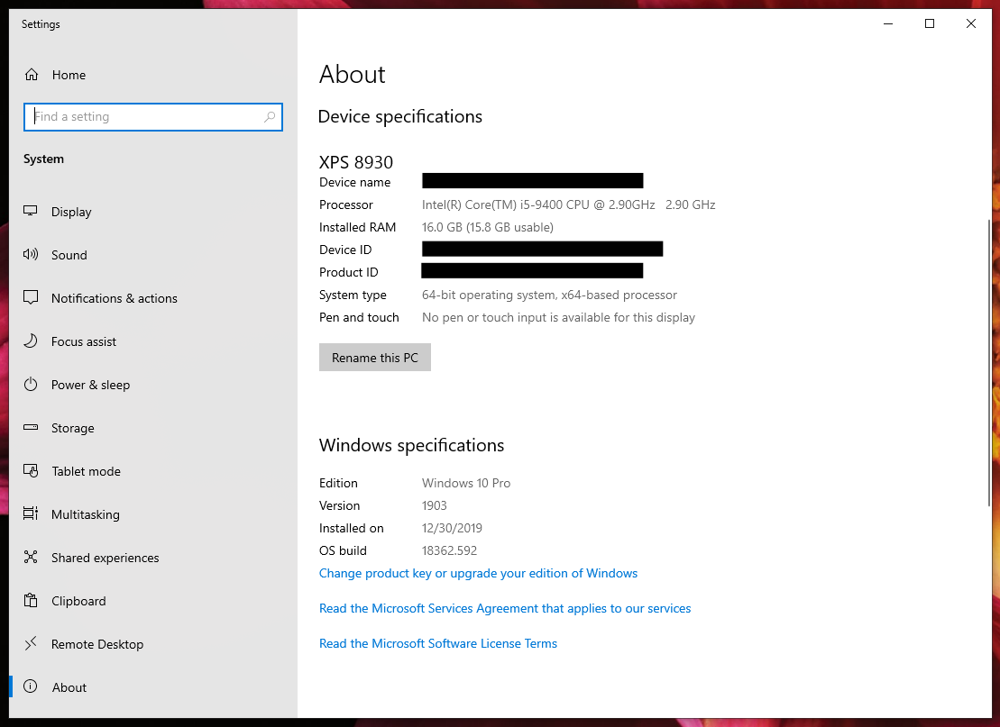

# Checking if your computer meets minimum system requirements

1. The minimum system requirements for running Audition can be found [here](https://helpx.adobe.com/audition/system-requirements.html).
2. To see your computer's specs \(processor, operating system, RAM\), press **Windows X** \(on keyboard--**Windows** key is between **Ctrl** and **Alt**.\) 
3. In the fly-out menu, click **System**.
4. Your computer's specs \(processor, operating system, RAM\) will appear under **Device specifications**. Your computer's operating system will appear under **Windows specifications.**
5. To see the amount of space available on your computer, press **Windows E** \(on keyboard--**Windows** key is between **Ctrl** and **Alt**.\)
6. Click **This PC** \(on left.\)
7. The amount of space available will be visible under the **C:** drive.

