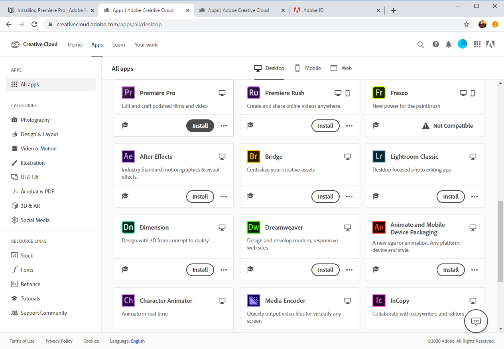

# Installing Premiere Pro

1. In a browser, go to the [Adobe Creative Cloud sign in screen](https://creativecloud.adobe.com).
2. Enter your **UWM email address** and click **Continue**.
3. If prompted, select **Company or School Account**. \(**Note**: At this point, you may need to enter your ePanther password.\)
4. When prompted with **UWM 1Login screen**, enter your ePanther username and password. \(**Note**: If you see an **ERROR** screen, try the steps listed above again. It should work on the second attempt.\)
5. In the Creative Cloud online interface, click **Apps** \(top left.\)
6. In the **Apps** area, scroll through the available apps until you find **Premiere Pro**. Click the **Install** button. An **Installing** progress wheel will appear in the **Apps** interface. When this process is complete, an EXE file will download to your computer.
7. After the download process is complete, double-click the EXE file \(it may be in your **Downloads** folder.\) If you are prompted with a dialog box asking if you want to allow this app to make changes to your device, click **Yes**.
8. Proceed through all of the installation steps.
9. When installation is complete, **Premiere Pro** will appear in the **Start** menu on your PC.

